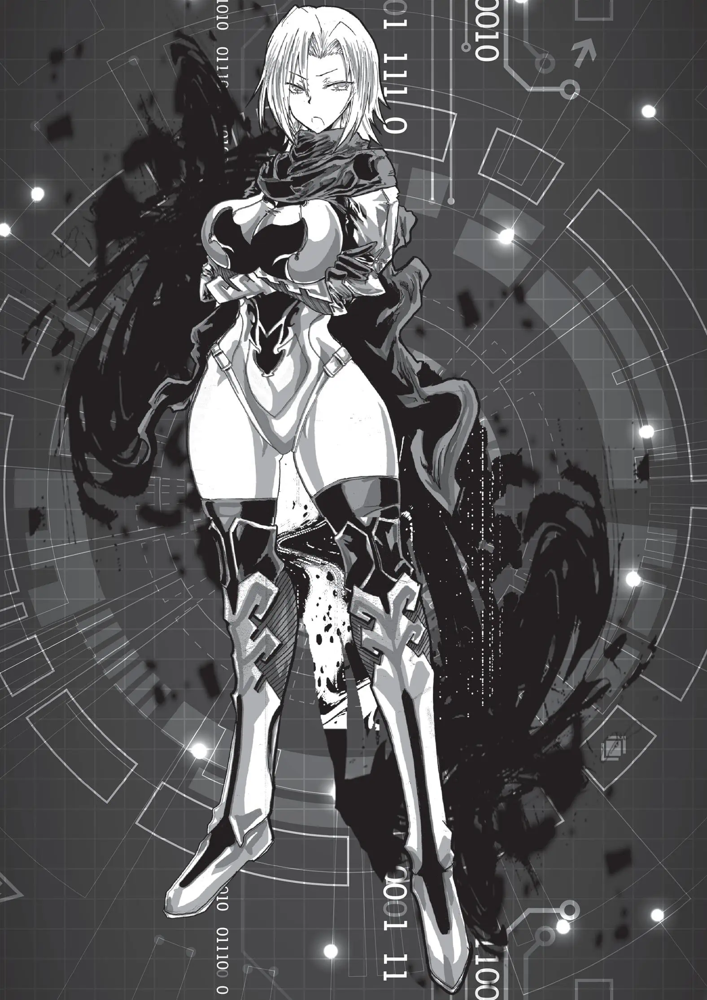

# Ventangle汉化

## 译者说明

本规则汉化首发于：

[https://github.com/ventangle-zh-cn/ventangle-zh-cn]("Ventangle汉化仓库")

欢迎到上述地址反馈翻译问题或是获取最新版本。

官方：

[神谷涼的推](https://twitter.com/kamiyaryo)

[ZQ Works官网](http://zqworks.ao-works.net/)

购买地址：

- Ventangle （核心）：
  - [booth](https://zqworks.booth.pm/items/3327158)
  - [dlsite](https://www.dlsite.com/maniax/work/=/product_id/RJ345891.html)
  - [cokage](http://shop-cokage.net/annex/ventangle.html)
  - [melonbooks](https://www.melonbooks.co.jp/detail/detail.php?product_id=1029153)
  - [toranoana](https://ec.toranoana.jp/tora_r/ec/item/040030918772/)
- Kamimachi Street （扩展）：
  - [booth](https://zqworks.booth.pm/items/4042653)
  - [dlsite](https://www.dlsite.com/maniax/work/=/product_id/RJ402685.html)
  - [melonbooks](https://www.melonbooks.co.jp/detail/detail.php?product_id=1522752)
  - [toranoana](https://ec.toranoana.jp/tora_r/ec/item/040030992063/)
- Game Box1 （模组）：
  - [booth](https://zqworks.booth.pm/items/4137420)
  - [dlsite](https://www.dlsite.com/maniax/work/=/product_id/RJ415954.html)
- Kachikomi Inventory （扩展）：
  - [booth](https://zqworks.booth.pm/items/4660867)
  - [dlsite](https://www.dlsite.com/maniax/work/=/product_id/RJ01044773.html)
  - [melonbooks](https://www.melonbooks.co.jp/detail/detail.php?product_id=1855498)
  - [toranoana](https://ec.toranoana.jp/tora_r/ec/item/040031050339/)

[Ventangle英文翻译站](https://ventangle.miraheze.org)

版本历史：

~~2024年2月30日发布v0.1译版 同步已有翻译。~~

[TOC]

# Ventangle

### 24世纪，堕落的熔炉

已然不会发生全面战争。

已然不再遭受灭顶天灾。

环境破坏已经停止。

能源问题已经解决。

伴随而来的……便是人类的堕落。

堕落唤起了一场“大变革”，扭曲了世界，改写了史书。

科学与魔法血乳交融。

机械、妖精与神明们为非作歹。

富人们耽溺于永恒者奢华的肉欲而沦为废人。^①^

穷人们被迫成为强改者艰苦劳动而偿还债务。

下水道之中，僵尸与史莱姆蠢蠢欲动。

如今的世界已经被混乱所污染，成为了堕落的熔炉。

*(译者注：①永恒者，原文ELF。具体翻译参见后文。)*

#### 充满魔法的赛博朋克

> **『这个世界无所谓。我自己也无所谓。**
>
> **然而你们这帮无所谓的家伙，才是我还活着的理由。』**
>

**——浊世雪莲（Pure Princess），实况主&悬赏目标**

舞台是一座未来都市。

也就是所谓的赛博朋克。

而且是魔法与科学并存的赛博朋克。

这个社会，被企业与教团支配着。

企业士兵们在街道上手持突击步枪列队游行。

魔术师们在高新尖端实验室中编写魔法公式。

无数神明将自己的使徒送入现界，构筑教团。

繁华街上，魅魔们扯着路人的袖子努力拉客。

小巷子里，妖精和妖怪四处穿行，胡作非为。

黑社会中，吸血鬼们高高筑起了那犯罪帝国。

而市民也并非手无缚鸡之力。随身携带枪支匕首成为常态，危险的肉体改造比比皆是。

那个时代，肉体改造已经成为了一种时尚。

富人们换上了最理想的身体器官，在穷奢极糜的生活中向不死的存在——永恒者进发。

一个没有任何事物值得肯定的，混沌的社会。

一个扑灭了所有虚拟现实，蠕动前进的未来。

每个人都在漫无目的地寻求刺激与快感，渴望感受到生命的真实感。

社会也好，肉体也罢，早已经变成了一潭死水。

唯有肉体接触和思想交融，才能短暂地感受到自己还活着。

#### 网络世界的众神

> **「喂，我可不能把重要的东西跟你挑明白了。**
>
> **毕竟，活人的嘴可关不严实啊。」**

**——狐踪匿影（Kitsune Sign），电子狐狗狸**

与科学的高度进步恰恰相反，网络信息的发达程度与现在的社会基本相同。公共互联网服务甚至有倒退的迹象。没有什么脑机交换接口，连用虚拟现实来网上冲浪都不可能。企业将自己的秘密从网络上严密地隔离了起来。虚拟货币的信赖度很低，只有现金(信用点)才是硬通货。

这也是没办法的办法。

支配电子世界的东西并非人类也非企业……而是作为信息生命体而诞生的，难以计数的神明。
神明都是以自我为中心的利己主义者，而且极为狡猾。

在变成众神乱世的电脑世界里，任何规章或者制度都没有话语权。神明的性格往往喜怒无常，不知何时就会突然公开某些情报。

娱乐和社交网络都是由神明来提供的，同时负责让信息流保持流动……然而企业并不信任他们。

> **「给与粮食，又爱、美、胜。不须他报。**
>
> **但须支吾之领域，蒙神我之“权利”。」**

**——伊什塔尔，自然与丰收之女神**

运营并且活用信息网络的正是“教团”。

教团是一个组织群体，他们和企业一起控制着这个社会。

这是由蒙受了神之启示的使徒们，或者得到了肉身的神明自身来运营的。

他们控制着大部分的情报媒体和娱乐服务。那些负责宣传和监视的无人机，也基本都是教团的东西。

视频平台，社交网络，交易网站，游戏。这些内容被作为祭祀神灵的“仪式”。VR技术的泛用化被强行终止也是企业对神明的反抗。

而且，历史悠久的神明们大多都掌握着农耕和丰收，也有神灵控制酒类。事到如今，神明已经成为了食品生产的关键。

凭借对网络的支配权和娱乐的需求，神明和他们的教团成为了这个社会上不可或缺的存在。

#### 毫无尽头的混沌
> **「每个组织都希望给所有居民登陆编号，在所有角落都装上摄像头。但是，其他组织决不会允许发生这种事情。当这座城市的黑暗消亡之时，我们的工作也就到头了。」**

**——法芙娜（Valrhona），黑衣调停人**

虽然有企业和教团的双重压力，但监视尚未覆盖全社会。

不巧的是，两方都因为各种势力而极为臃肿，光是内部就应顾不暇。更甚的是，犯罪团伙和个别性情暴戾的妖精与神明也有着无法忽视的影响力。

即使是规模庞大的教团或企业，也无法将所有都囊括进来。

监控摄像只存在于各个组织的领地和设施内部。

每当有新的魔法被发明出来，或是某些新妖精和神明诞生，混乱程度就会增加。

一个毫无威胁的普通市民，可能某一天就会突然变成神明的使徒，亦或是吸血鬼之类的东西。同样，无论多么强大的人也可能阴沟里翻船。

社会永远处于混沌之中。在黑暗之中蛰伏着什么、下一个瞬间会发生什么事情……即使是真神也无法轻易断言。

#### 追猎者（Hunter）
> **「只要你敢报上名来，那你就能自称追猎者。这里不讲口碑。**
>
> **当然，你只有能完成委托，才能彰显出实力。」**

**——地狱摇篮（Bassinet），退休追猎者**

在这个混沌的社会中，自然需要“不属于任何势力的人”。

脏活累活，不能见光的工作，犯罪协助。

这种方便的人才就是所谓的“追猎者”。

这并非隶属关系或是工作，而是一种社会阶层的称呼。是对那些逃亡者、罪犯和反社会人士的总称。

你也将作为一名追猎者在这个世界上东奔西跑。

追猎者可以是侦探、是佣兵、是赏金猎人、是保镖、是线人、是杀手、是名媛。

追猎者可以从很多地方接到各种委托。

网络上就有很多的追猎者的论坛或者社交网站。也有一些追猎者会去同伴出没的酒馆，甚至有的人以侦探或是佣兵的名义设立了个人事务所。

想要一份体面一点的工作的话，加入安保公司或者雇佣兵机构也是个不错的选择。

那些想要找追猎者的委托人们……要么是在走投无路的悬崖边，要么就是想要一次性的弃子。

请务必带着相应的谨慎和觉悟，去承接那些委托。

每一天，都有几个自称是追猎者的人被淘汰。

能够让自己和他人都认可的专业猎人，实际上只有一小把。

#### 堕天特区

> **「传奇什么的，在这边还挺常见的吧。」**

**——地狱狂狮（Hellion），活着的传奇**

在这个混沌的世界之中，最为混沌的都市。

其本身就是堕落的象征的，圆柱形的高层都市。

此处，臭名昭著的“堕天特区”，就是你们编制传奇的地方。

> **「如果不是这里，还真是得不到这种力量呢♪**
>
> **也就是说，和你相遇可真是我的天命呀。」**

**——跃动闪光（Blink），触碰禁忌之人**

堕天特区是从太空卫星轨道上坠落下来的宇宙空间站。
凭借魔法驱动，它平缓地降落在了大阪湾之中，这也让全世界都见识到了魔法的力量。
此处正是这个世界上混沌漩涡的核心。
充斥着强烈的魔力，神明与妖精云集的场所。
因此，各路精英学者荟萃于此，企图活用魔法的公司蜂拥而至，现世神明引导的教团野蛮生长。
不久之后，这奇妙的高层都市就诞生了。
无数的组织聚集在一起，这里已然不再是单单一个国家或企业能支配的地方……因此只是被赋予了“堕天特区”这个名字。

> **「堕落的都市，自然会吸引堕落的人群。**
>
> **我大概……也堕落了吧。还是有这种自知之明的。」**

**——谢幕清单（End Roll），倒霉的暗杀者**

顶层的外墙是富人的居住区和大企业、大教团的地盘。
空间站内部则已经被改造成了一个巨大的可居住城市。
外围被工厂、研究所、各种设施和仓库所覆盖。
在另一侧，那些被倾斜的阴影所笼罩的地方，是一个混沌的平民窟。
而且，内部和外壁之间的空间，形成了一座复杂而离奇的迷宫。
此外，妖精和神名创造出来的异界，则出现在各种地点。
上下、前后、里外，这座城市正在从各种角度向外蔓延着。
事到如今，即使是其中的居民都无法完全掌握这里的全貌了，简直像一个魔窟一样。
此处正是，数不胜数的欲望卷起旋涡的海洋。
罪恶与阴谋抽刀断水，同样，英雄辈出，传奇不断。
追猎者们挣扎在没有任何组织作为后盾的孤独而危险的生活之中。
这样的追猎者，究竟是会成为无名小卒，还是名扬天下呢。
这一切都取决于你。

> **「OK。也就是说，我现在可以给你一枪了吧。」**

**——穷命恶徒（Desperado），新手追猎者**

## 阅读指南

### 前言

本作品是成人向的TRPG。

此外，本规则不适合第一次尝试TRPG类型游戏的玩家。

因此本规则是以您已经有过一定程度的TRPG游戏经验，并且能够阅读并理解规则书为前提编写的。

本规则的标准玩家组成为一名GM和一名PL。如果想要有更多玩家参与的话，后续规则中提供了一些必要的额外注意事项(P138)。

除开创建角色，一次跑团的时间大约在三个小时左右。

用一晚上的时间来完整地体验一个剧本是完全可行的。

不过，倘若在角色扮演上用了更多精力，或通过某些活动来丰富剧本的游戏体验，时间也许会变得更长。

#### 本书阅读指南

本书分为若干个档案夹。

下面概述了各个档案夹的内容。

- **Readme**

你如果是第一次玩成人向TRPG，那么这一部分是应当最优先阅读的内容。即使你是一个经验丰富的老玩家，也应该略读一遍。

- **追猎者档案夹**

包含了20名预备好的追猎者数据和传记。可以作为了解本世界观的氛围与设定的线索和媒介。如果是第一次玩这个规则，可以使用她们作为你的角色。

- **个人档案夹**

包含了为了构建你所扮演的追猎者而准备的大量数据。想花时间亲自制作自己的追猎者，请仔细阅读这一部分的内容。

- **系统档案夹**

包含了如何运作该游戏的规则。你想亲身体验这个游戏的话，请务必阅读这一部分的内容。

- **地图档案夹**

如果想了解更多你所活跃的舞台的设定，请阅读这一部分。可以帮助丰富PC的背景故事和剧本的详细设定。

- **主持人档案夹**

这一部分包含了为GM准备的规则和建议，还有有助于撰写剧本的数据和故事。基本上是为GM准备的内容，不推荐一般玩家阅读。

- **机密档案夹**

在这里准备了预先写好的范例剧本。如果是第一次当GM，也可以活用这一部分的例子。如果你作为玩家参加游戏，那么请不要阅读它。

#### TRPG用语解释

接下来，是在阅读本书中需要用到的名词。

不用完全记住这部分的内容，只要在遇到不清楚的词汇的时候，回到这一页查询即可。

**nD6：**掷n个六面骰，然后将其点数相加。

1D6的话最终值就是骰值，2D6的话是2~12之间，以此类推。

**nD10：**掷n个十面骰，然后将其点数相加。

**D66：**掷两个六面骰，其中一个作为十位数，另一个作为个位数。用于取11~66之间的数值的替代方式。如果是线上的话，掷2D6，然后按顺序取点数。

**GM：**主持人(Game Master)。主持游戏进行的参加者。

**PL：**玩家(Player)。除GM以外的参加者，本规则中基本上只有一名。

**PC：**玩家所扮演的角色(Character)。每名玩家各制作一名，以此参加游戏。本规则中基本上只有一名。

**NPC：**GM所扮演的所有角色。简而言之，除了PC以外全都是NPC。

**RP：**角色扮演(Role Play)。表演或者描写自己的角色或其他状态。

**ERP：**性方面的角色扮演。具体什么是性行为取决于参加者之间的共识。

**共识：**在跑团开始之前参加者之间彼此进行观念磨合的过程。主要是关于性行为的观念。

**剧本：**PC所承接的委托内容以及如何进行。也可以说是跑团的脚本或者设定表之类。由GM准备。

**跑团：**按照本规则，完整地体验一个剧本的一次游戏流程。即使实际游戏时间不止一天，规则上也视为「一次跑团」。

**角色卡：**用于记载角色的数据的卡片(P216)。不过，由于本规则推荐线上，因此使用电子格式的角色卡效果会更好。

#### 数据用语

以下是各种数据中常用的符号和缩写。

如果在本书中遇到不清楚的词汇，或是在判断时有疑惑，可以参照这一部分。

**【】：**用于标识角色能够通过金钱获取的「服装」「装备」「物品」的名称。

**《》：**用于标识角色作为特殊能力的「力量」的名称。

**［］：**各种数据内的数值的计算方法。当出现一些数据名称（例如「判定值」等）时，用于表示具体数值。当因除法运算而产生余数时，如果没有特殊规定，则一律向上取整。

**「」：**用于标识需要特殊注意的规则用语。伤害、角色属性、武器特性和给予的负面状态等。

**／：**如果有复数个词语被这个符号分割开来，意味着「从被划分的词语中选择一个」。

**BS：**负面状态(Bad State)。表示角色的肉体或是精神上无法自主的状态。

**GB：**差值奖励(Gap Bonus)。在进行战斗中判定时，若你的判定值远大于目标值就会发生的某种奖励。

射程：效果范围。在本规则中基本都是攻击的射程距离范围。

#### 世界观用语

以下是关于在本作的世界观中用到的名词的介绍。

**24世纪：**本作舞台所在的时代。公元2300年。

**DH：**改造人(Designed Human)的缩写。通过基因改造以及其他方法，使自己超越人类物种的生命。永恒者和强改者是其中代表性的种族。^①^

**装备：**各种基于科学和魔法对身体进行的持续性改造。根据使用的技术可以分为不同的类别。
信用点：这个世界上的货币单位。基本上，一信用点约等于一万日元。还有一些小单位货币，例如「硬币(100日元)」和「筹子(1日元)」等，不过很少在跑团中使用。^②^

**神明：**一个作为专有名词并且得到广泛认可的魔法性实体。作为情报生命体，活跃在电子信息网络当中。

**企业：**主导大部分社会的经济组织。不过，由于教团的存在阻止了资本主义监控社会的实现。

**教团：**崇拜各种神明的宗教性组织的总称。他们对电子信息网络有着很强的影响力。他们的性质与目的因所崇拜的神明而大不相同。

**堕天特区：**作为本作品主要舞台的24世纪都市。处于混乱和颓废的状态中，与其说是犯罪都市，倒不如说是混沌都市。许多地方都在窥探PC们的力量。

**追猎者：**一群不属于任何特定组织的万事屋。在大部分人的心目中，他们几乎都是罪犯，实际上也是一群不择手段的人。他们更类似于侦探、赏金猎人、杀手或是线人。也是本规则中PC们的性质。

**魔法：**一种通过使魔力而产生的某些物理或精神效果。主观发动魔法的技术被称之为魔术。严格来说，几乎所有的现象都是魔法。

**妖精：**对已获得自我意识的魔法性存在的总称。有许多种族，其中也存在着魅魔或是吸血鬼这样的PC可选种族。

***译者注：***

*①:ELF，全称Eternal Leading Figure，直译为永恒领导者，本文译为永恒者。需要与传统意义上的精灵做区分。*

*ORC，全称Over Reinforced Creature，直译为过度强化的生物，本文译为强改者。需要与传统意义上的兽人做区分。*

*②:截止2021年，一万日元的购买力可以大概等价于一百元人民币。*

### 成人向跑团的心得

### 共识

### 线上跑团

## 追猎者档案夹

### 模板追猎者

#### 穷命恶徒

### 参考资料①

## 个人档案夹

### 制作追猎者

#### 推荐武器表

| 领域 | 推荐武器 |
| ---- | ---- |
| 破局手 | 利器、格斗、手枪、圣物 |
| 护卫者 | 利器、手枪、突击步枪、强化服 |
| 神枪手 | 手枪、突击步枪、狙击步枪 |
| 暗杀者 | 利器、格斗、手枪、狙击步枪 |
| 魔术师 | 法杖、圣物、强化服 |
| 妖术师 | 法杖、祸鞭、诱惑 |
| 调停人 | 格斗、手枪、诱惑 |
| 探秘人 | 手枪、诱惑、强化服 |
| 风流客 | 格斗、手枪、诱惑 |
| 洗脑师 | 法杖、祸鞭、诱惑 |

#### 武器表

#### 妖精表

#### 神明表

#### 人脉表

#### 角色类型表

#### 身体形式表

#### 服装表

#### 住所表

#### 追猎者称号表

### 野路子Irregular

### 老江湖Professional

### 古血统Elder Blood

### 换身灵Changeling

### 永恒者ELF

### 人造人Automata

### 魅魔Succubus

### 吸血鬼Vampire

### 神使者Apostle

### 现人神Avatar

### 破局手Fighter

### 护卫者Soldier

### 神枪手Gunner

### 暗杀者Assassin

### 魔术师Magi

### 妖术师Witch

### 调停人Fixer

### 探秘人Seeker

### 风流客Bitch

### 洗脑师Dominant

### 电子装备

### 魔术装备

### 生化装备

### 纳米装备

### 道具

### 利器

### 格斗

### 手枪

### 突击步枪

### 狙击步枪

### 法杖

### 祸鞭

### 诱惑

### 圣物

### 强化服

### 参考资料②

## 系统档案夹

### 跑团流程

### 判定

### 恢复

### 能力

### 人脉

### ERP

### 工作的管理

### 战斗

### 武器的能力与特殊效果

### 负面状态

### 角色属性

### 成长

### 俗世

### 斗争

### 枪艺

### 死神

### 幻惑

### 淫魔

### 咒术

### 暗黑

### 祝福

### 混沌

### 多个PC参与的跑团

### 不含性行为的Ventangle

## 地图档案夹

### 这个世界的一切因何而起

### 大变革

### 堕天特区的建立

### 堕天特区的构造

### 乐园区

### 住宅区

### 港湾区

### 外壁区

### 宵暗区

### 迷宫区

### 异界

### 24世纪的社会

### 近未来的性描写

### 新的居民

### 大妖

### 堕天特区的组织

### 怡丽丝尔集团

### 姐妹会警备保障

### 八重家

### 刘家

### 伊什塔尔神殿

### 妖辻酒吧

### 法芙娜

### Nobullshit

### 地下技术人员

### 武器商人

### 堕天特区的传说

## 主持人档案夹

### GM指南

### 剧本编写：NPC的设计

### 剧本编写：活跃的场景

### 剧本编写：委托

### 剧本编写：遭遇

### 剧本编写：战斗

### 剧本编写：敌对NPC

### 补充的GM指南

## 机密档案夹

### 剧本阅读指南

### 剧本：HUNTING GAME

### 剧本：DEAD GAME

### 剧本：DEAD GAME

### 索引