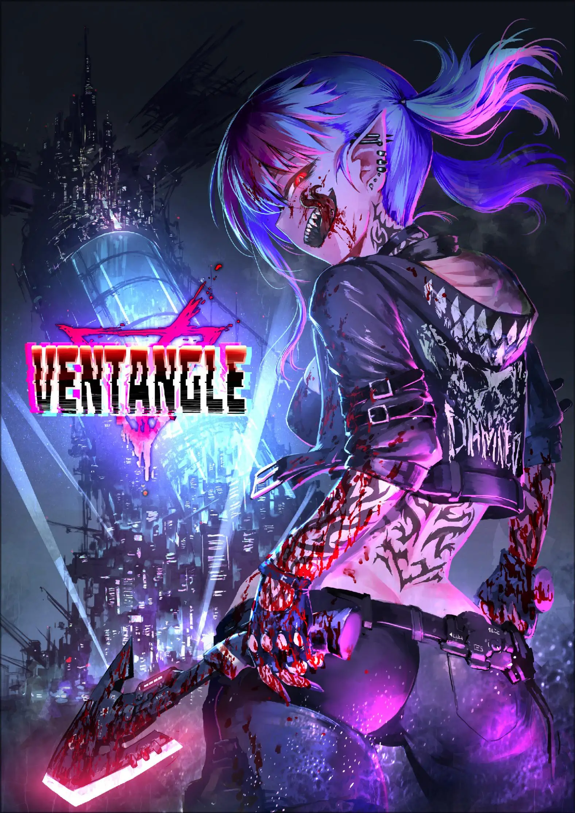

# Ventangle汉化

## 译者说明

本规则汉化首发于：

[https://github.com/ventangle-zh-cn/ventangle-zh-cn]("Ventangle汉化仓库")

欢迎到上述地址反馈翻译问题或是获取最新版本。

官方：

[神谷涼的推](https://twitter.com/kamiyaryo)

[ZQ Works官网](http://zqworks.ao-works.net/)

购买地址：

- Ventangle （核心）：
  - [booth](https://zqworks.booth.pm/items/3327158)
  - [dlsite](https://www.dlsite.com/maniax/work/=/product_id/RJ345891.html)
  - [cokage](http://shop-cokage.net/annex/ventangle.html)
  - [melonbooks](https://www.melonbooks.co.jp/detail/detail.php?product_id=1029153)
  - [toranoana](https://ec.toranoana.jp/tora_r/ec/item/040030918772/)
- Kamimachi Street （扩展）：
  - [booth](https://zqworks.booth.pm/items/4042653)
  - [dlsite](https://www.dlsite.com/maniax/work/=/product_id/RJ402685.html)
  - [melonbooks](https://www.melonbooks.co.jp/detail/detail.php?product_id=1522752)
  - [toranoana](https://ec.toranoana.jp/tora_r/ec/item/040030992063/)
- Game Box1 （模组）：
  - [booth](https://zqworks.booth.pm/items/4137420)
  - [dlsite](https://www.dlsite.com/maniax/work/=/product_id/RJ415954.html)
- Kachikomi Inventory （扩展）：
  - [booth](https://zqworks.booth.pm/items/4660867)
  - [dlsite](https://www.dlsite.com/maniax/work/=/product_id/RJ01044773.html)
  - [melonbooks](https://www.melonbooks.co.jp/detail/detail.php?product_id=1855498)
  - [toranoana](https://ec.toranoana.jp/tora_r/ec/item/040031050339/)

[Ventangle英文翻译站](https://ventangle.miraheze.org)

版本历史：

~~2024年2月30日发布v0.1译版 同步已有翻译。~~

[TOC]

# Ventangle

### 24世纪，堕落的熔炉

已然不会发生全面战争。

已然不再遭受灭顶天灾。

环境破坏已经停止。

能源问题已经解决。

伴随而来的……便是人类的堕落。

堕落唤起了一场“大变革”，扭曲了世界，改写了史书。

科学与魔法血乳交融。

机械、妖精与神明们为非作歹。

富人们耽溺于永恒者奢华的肉欲而沦为废人。^①^

穷人们被迫成为强改者艰苦劳动而偿还债务。

下水道之中，僵尸与史莱姆蠢蠢欲动。

如今的世界已经被混乱所污染，成为了堕落的熔炉。

*(译者注：①永恒者，原文ELF。具体翻译参见后文。)*

#### 充满魔法的赛博朋克

> 『这个世界无所谓。我自己也无所谓。
>
> 然而你们这帮无所谓的家伙，才是我还活着的理由。』
>

——浊世雪莲（Pure Princess），实况主&悬赏目标

舞台是一座未来都市。

也就是所谓的赛博朋克。

而且是魔法与科学并存的赛博朋克。

这个社会，被企业与教团支配着。

企业士兵们在街道上手持突击步枪列队游行。

魔术师们在高新尖端实验室中编写魔法公式。

无数神明将自己的使徒送入现界，构筑教团。

繁华街上，魅魔们扯着路人的袖子努力拉客。

小巷子里，妖精和妖怪四处穿行，胡作非为。

黑社会中，吸血鬼们高高筑起了那犯罪帝国。

而市民也并非手无缚鸡之力。随身携带枪支匕首成为常态，危险的肉体改造比比皆是。

那个时代，肉体改造已经成为了一种时尚。

富人们换上了最理想的身体器官，在穷奢极糜的生活中向不死的存在——永恒者进发。

一个没有任何事物值得肯定的，混沌的社会。

一个扑灭了所有虚拟现实，蠕动前进的未来。

每个人都在漫无目的地寻求刺激与快感，渴望感受到生命的真实感。

社会也好，肉体也罢，早已经变成了一潭死水。

唯有肉体接触和思想交融，才能短暂地感受到自己还活着。

#### 网络世界的众神

> 「喂，我可不能把重要的东西跟你挑明白了。
>
> 毕竟，活人的嘴可关不严实啊。」

——狐踪匿影（Kitsune Sign），电子狐狗狸

与科学的高度进步恰恰相反，网络信息的发达程度与现在的社会基本相同。公共互联网服务甚至有倒退的迹象。没有什么脑机交换接口，连用虚拟现实来网上冲浪都不可能。企业将自己的秘密从网络上严密地隔离了起来。虚拟货币的信赖度很低，只有现金(信用点)才是硬通货。

这也是没办法的办法。

支配电子世界的东西并非人类也非企业……而是作为信息生命体而诞生的，难以计数的神明。
神明都是以自我为中心的利己主义者，而且极为狡猾。

在变成众神乱世的电脑世界里，任何规章或者制度都没有话语权。神明的性格往往喜怒无常，不知何时就会突然公开某些情报。

娱乐和社交网络都是由神明来提供的，同时负责让信息流保持流动……然而企业并不信任他们。

> 「给与粮食，又爱、美、胜。不须他报。
>
> 但须支吾之领域，蒙神我之“权利”。」

——伊什塔尔，自然与丰收之女神

运营并且活用信息网络的正是“教团”。

教团是一个组织群体，他们和企业一起控制着这个社会。

这是由蒙受了神之启示的使徒们，或者得到了肉身的神明自身来运营的。

他们控制着大部分的情报媒体和娱乐服务。那些负责宣传和监视的无人机，也基本都是教团的东西。

视频平台，社交网络，交易网站，游戏。这些内容被作为祭祀神灵的“仪式”。VR技术的泛用化被强行终止也是企业对神明的反抗。

而且，历史悠久的神明们大多都掌握着农耕和丰收，也有神灵控制酒类。事到如今，神明已经成为了食品生产的关键。

凭借对网络的支配权和娱乐的需求，神明和他们的教团成为了这个社会上不可或缺的存在。

## 阅读指南

### 前言

#### 本书阅读指南

#### TRPG用语解释

#### 数据用语

#### 世界观用语

### 成人向跑团的心得

### 共识

### 线上跑团

## 追猎者档案夹

### 模板追猎者

#### 穷命恶徒

### 参考资料①

## 个人档案夹

### 制作追猎者

#### 推荐武器表

| 领域 | 推荐武器 |
| ---- | ---- |
| 破局手 | 利器、格斗、手枪、圣物 |
| 护卫者 | 利器、手枪、突击步枪、强化服 |
| 神枪手 | 手枪、突击步枪、狙击步枪 |
| 暗杀者 | 利器、格斗、手枪、狙击步枪 |
| 魔术师 | 法杖、圣物、强化服 |
| 妖术师 | 法杖、祸鞭、诱惑 |
| 调停人 | 格斗、手枪、诱惑 |
| 探秘人 | 手枪、诱惑、强化服 |
| 风流客 | 格斗、手枪、诱惑 |
| 洗脑师 | 法杖、祸鞭、诱惑 |

#### 武器表

#### 妖精表

#### 神明表

#### 人脉表

#### 角色类型表

#### 身体形式表

#### 服装表

#### 住所表

#### 追猎者称号表

### 野路子Irregular

### 老江湖Professional

### 古血统Elder Blood

### 换身灵Changeling

### 永恒者ELF

### 人造人Automata

### 魅魔Succubus

### 吸血鬼Vampire

### 神使者Apostle

### 现人神Avatar

### 破局手Fighter

### 护卫者Soldier

### 神枪手Gunner

### 暗杀者Assassin

### 魔术师Magi

### 妖术师Witch

### 调停人Fixer

### 探秘人Seeker

### 风流客Bitch

### 洗脑师Dominant

### 电子装备

### 魔术装备

### 生化装备

### 纳米装备

### 道具

### 利器

### 格斗

### 手枪

### 突击步枪

### 狙击步枪

### 法杖

### 祸鞭

### 诱惑

### 圣物

### 强化服

### 参考资料②

## 系统档案夹

### 跑团流程

### 判定

### 恢复

### 能力

### 人脉

### ERP

### 工作的管理

### 战斗

### 武器的能力与特殊效果

### 负面状态

### 角色属性

### 成长

### 俗世

### 斗争

### 枪艺

### 死神

### 幻惑

### 淫魔

### 咒术

### 暗黑

### 祝福

### 混沌

### 多个PC参与的跑团

### 不含性行为的Ventangle

## 地图档案夹

### 这个世界的一切因何而起

### 大变革

### 堕天特区的建立

### 堕天特区的构造

### 乐园区

### 住宅区

### 港湾区

### 外壁区

### 宵暗区

### 迷宫区

### 异界

### 24世纪的社会

### 近未来的性描写

### 新的居民

### 大妖

### 堕天特区的组织

### 怡丽丝尔集团

### 姐妹会警备保障

### 八重家

### 刘家

### 伊什塔尔神殿

### 妖辻酒吧

### 法芙娜

### Nobullshit

### 地下技术人员

### 武器商人

### 堕天特区的传说

## 主持人档案夹

### GM指南

### 剧本编写：NPC的设计

### 剧本编写：活跃的场景

### 剧本编写：委托

### 剧本编写：遭遇

### 剧本编写：战斗

### 剧本编写：敌对NPC

### 补充的GM指南

## 机密档案夹

### 剧本阅读指南

### 剧本：HUNTING GAME

### 剧本：DEAD GAME

### 剧本：DEAD GAME

### 索引